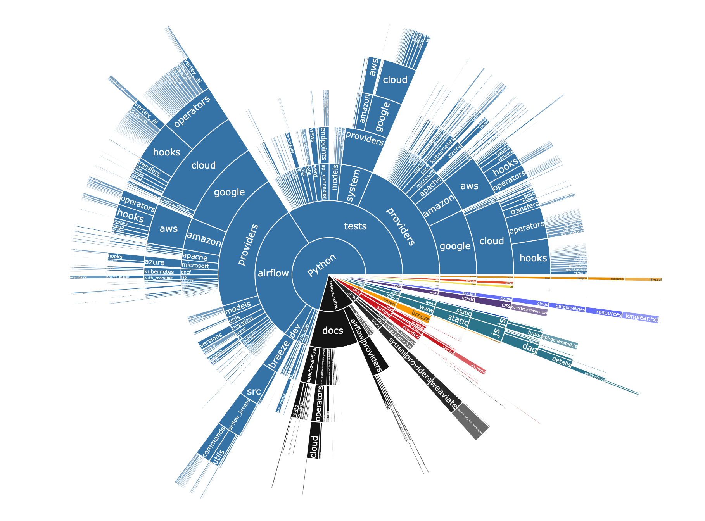

# tokei-pie

Render [tokei](https://github.com/XAMPPRocky/tokei) results to charts. 🦄

<a href="https://badge.fury.io/py/tokei-pie"></a>


## Installation

```shell
pip install tokei-pie
```

## Usage

```shell
$ tokei -o json | tokei-pie
```

🪄



(This is how [django](https://github.com/django/django) looks like!)
